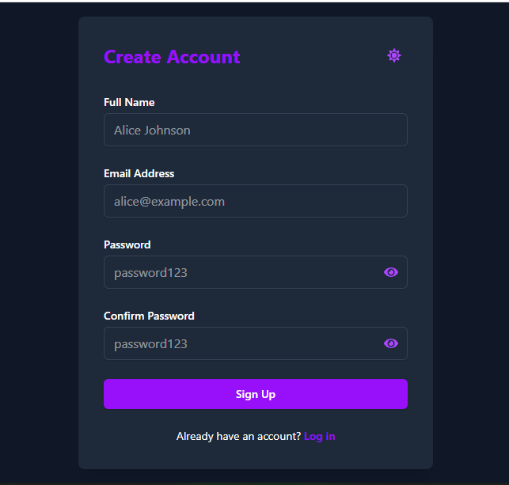
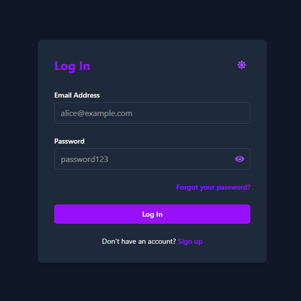
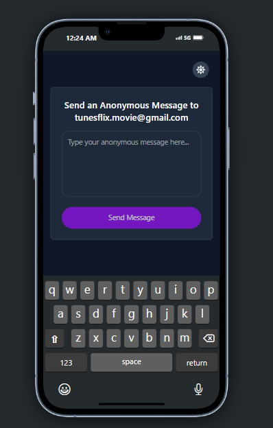
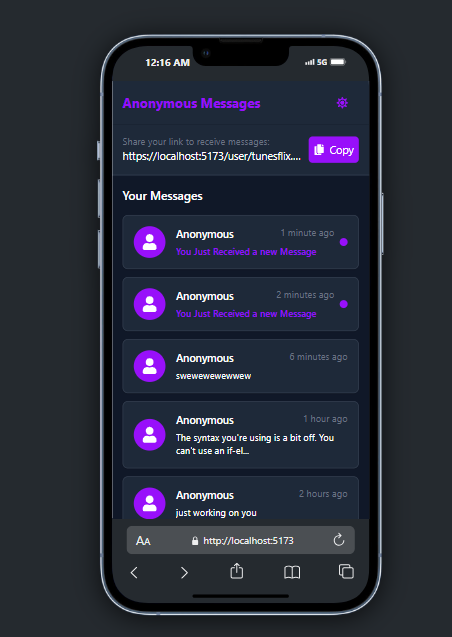
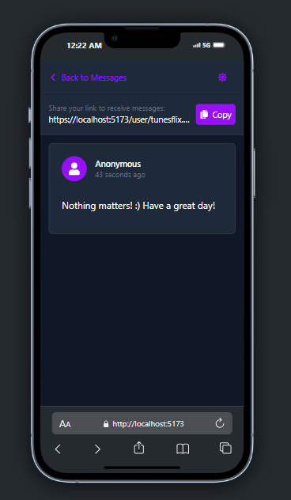

# Anonymous Messaging Platform

A modern, responsive web application that allows users to receive anonymous messages through shareable links. Built with React, TailwindCSS, Laravel API backend, and MySQL.

---

## 📸 Screenshots

> Replace the image paths below with actual screenshots of your pages.

- **Homepage**  
  

- **SignUp Page**  
  

- **Login Page**  
  

- **Anonymous Message Page**  
  

- **User Inbox (Message List)**  
  

- **Message Details View**  
  

---

## ✨ Features

### 🔗 Shareable User Link
- Unique user link:  
  `https://{domain}/user/{email}/{id}`
- Visitors can send messages anonymously via this link.

### 📝 Anonymous Message Submission
- Message form with character-limited textarea.
- Displays recipient's email.
- Sends POST request to Laravel API.

### 📥 User Inbox
- View received messages with:
  - Message preview
  - Read/unread status
  - Time since received (e.g., "2 minutes ago", "3 days ago")
- Messages marked as read when opened.

### 🌙 Light/Dark Mode
- Toggle theme using sun/moon icons from `react-icons`.
- Theme applied across all pages using TailwindCSS.

### 🌀 Custom Loading State
- Animated loading spinner or UI skeleton while fetching messages.

---

## 🔧 Tech Stack

| Technology | Usage |
|------------|--------|
| **React** | Frontend SPA |
| **TailwindCSS** | Styling |
| **Laravel** | Backend API |
| **MySQL** | Database |
| **React Router DOM** | Routing |
| **React Icons** | Icons including theme toggles |
| **Axios** (via `apiClient`) | API communication |

---

## 📂 Project Structure

